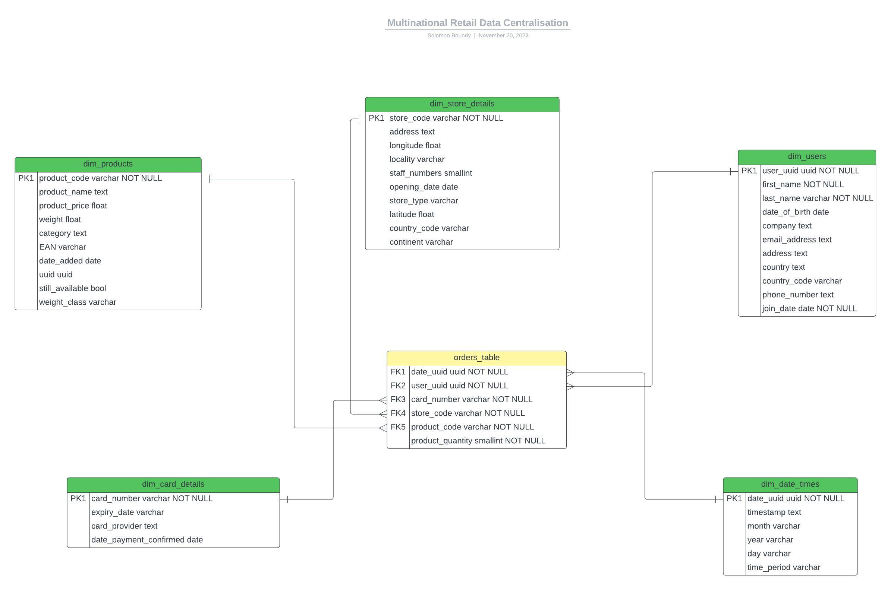

# Multinational Retail Data Centralisation

## Table of Contents:

1. [Project Description](#1-project-description)
1. [Project Structure](#2-project-structure)
1. [Installation Instructions](#3-installation-instructions)
1. [Usage Instructions](#4-usage-instructions)
1. [ERD](#5-ERD)
1. [File Structure](#6-file-structure)
1. [Contributions](#7-contributions)
1. [License Information](#8-license-information)

## 1. Project Description

A project mimicking a multinational company that sells goods across the globe. Streamlining their sales data which is spread across many different data sources, making it more easily accessible and analyzable for the company. This application makes the company's sales data accessible from one centralized location acting as a single source of truth.

## 2. Project Structure

The project is organized into three classes:

1. **DatabaseConnector:**

   - Handles database connection.
   - Reads database credentials from a YAML file.
   - Lists database tables.
   - Uploads a DataFrame to the database.

2. **DataCleaning:**

   - Cleans and processes data for various tables, including user data, card data, store data, product data, orders data, and sales data.
   - Converts product weights to kilograms.
   - Provides methods for cleaning various types of data.

3. **DataExtractor:**
   - Extracts data from different sources, including RDS tables, PDFs, URLs, and S3 buckets.

## 3. Installation Instructions

1. Clone the repository:

   ```bash
   git clone https://github.com/solomonboundy1/multinational-retail-data-centralisation.git
   cd multinational-retail-data-centralisation

   ```

1. Install dependencies:

   Ensure you have the necessary dependencies installed. You can install them using the following command:

   ```bash
   pip install -r requirements.txt

   ```

1. Set up database credentials:

   Create a db_creds.yaml file with your PostgreSQL credentials.

## 4. Usage Instructions:

Follow these steps to use the project:

- **Step 1:** Navigate to the Project Directory

  Open your terminal or command prompt and navigate to the directory where you have cloned or downloaded the project.

  ```bash
  cd /Users/(Your-username)/(where-you-downloaded the-project)/multinational-retail-data-centralisation
  ```

  replace the file path with the actual file path of the downloaded project.

- **Step 2:** Download and install pgAdmin and initialise an empty database.

- **Step 3:** Add your database credentials to the `db_creds.yaml` file in the format:

  ```
  POSTGRES_HOST: localhost
  POSTGRES_PASSWORD: YOUR_PASSWORD
  POSTGRES_USER: YOUR_USERNAME
  POSTGRES_DATABASE: sales_data
  POSTGRES_PORT: 5432
  ```

  **Note:** replace 'YOUR_PASSWORD' and 'YOUR_USERNAME with your postgre information respectively. Also add your RDS credentials in this file using the same format, instead of POSTGRES_HOST, POSTGRES_USER you must put RDS_HOST, RDS_USER and so on.

- **Step 4:** Create a file named `.env` in the root directory of the program if it doesn't exist.

- **Step 5:** Open the .env file and add your API key in the following format:

  ```bash
  API_KEY=your_api_key_here
  ```

  replace 'your_api_key_here' with your actual api key.
  Save and close the .env file.

- **Step 6:** Run the script.
  <br>Now you can run the main script to process and retrieve the data. Type:
  `bash
python main.py
`
  into the terminal to run the script.

  **Note:** Keep your API key confidential and do not share it publicly. The `.env` file is listed in the project's .`gitignore` to exclude it from version control.

- **Step 7:** Altering SQL Tables.

  To ensure the tables have the correct structure and data types, SQL queries are provided in the `SQL_queries_to_alter_tables.sql` file. After uploading the data to the database, execute the queries in this file one by one to alter the tables according to the project's specifications.

  ```sql
    -- Example SQL query to alter a table:
    ALTER TABLE table_name
    ALTER COLUMN column_name TYPE new_data_type;
  ```

## 5. ERD

Entity Relationship Diagram of database<br>



## 6. File Structure

    multinational-retail-data-centralisation/
    ├── main.py
    ├── requirements.txt
    ├── .env
    ├── .gitignore
    ├── db_creds.yaml
    ├── database_utils.py
    ├── data_cleaning.py
    ├── data_extraction.py
    ├── SQL/
    │   ├── database_build_queries.sql
    |   ├── business_queries.sql
    │   └── MRDC_ERD.jpeg
    ├── README.md
    └── MIT.txt

- **main.py**
  <br> This script is the main script to execute the loading, extration and cleaning of data.

- **requirements.txt** <br> This file contains the project's dependencies

- **.env** <br> An environment file to store sensitive information.

- **.gitignore** <br> A file specifying intentionally untracked files and directories that Git should ignore.

- **db_creds.yaml** <br>YAML file containing database credentials.

- **database_utils.py**<br> This is a class for connecting and interacting with the database.

- **data_cleaning.py** <br> A class for cleaning various types of data.

- **data_extraction.py** <br> A class for extracting data in various ways and from a number of sources.

- **/SQL**

  - **business_queries.sql**<br>
    Answers to the questions given by AiCore for the fourth milestone of the project
  - **database_build_queries.sql** <br> Queries to be executed one by one in SQL after data is in database.
  - **MRDC_ERD.jpeg** <br> Entity Relationship Diagram for Database

- **README.md** <br>Project documentation providing information on installation, usage, and file structure.

- **MIT.txt** <br> License for project

## 7. Contributions

- Solomon Boundy

## 8. License Information

This project is licensed under the MIT License - see the [MIT](MIT.txt) file for details.
